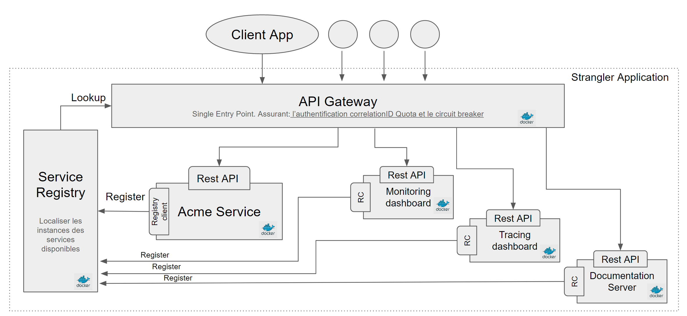

# Spring cloud Seed (Server)

## Description 

This reference application is a Spring Cloud example of implementing a [Strangler Pattern](https://www.martinfowler.com/bliki/StranglerApplication.html) using microservices. 

## Architecture Diagram



## Project structure

**1- Eureka Server (for service discovery register)** 

It's about using an Eureka server to maintain a registry of microservices. All with the help of the spring cloud project.
UI is available here : http://127.0.0.1:8002

- NB: Eureka Server exposes a REST API specially for communicating with non-java registry clients. Documentation is available here: [Eureka-REST-operations](https://github.com/Netflix/eureka/wiki/Eureka-REST-operations)
(If you can't believe me : http://127.0.0.1:8002/eureka/apps)

- Examples: Android example: (https://github.com/thomasletsch/moserp/blob/master/gui/inventory-app/app/src/main/java/org/moserp/common/rest/RestServiceRegistry.java)

**2- Zuul (API Gateway)**
 
 It's about an API gateway that represents a single entry point to our microservices. Zuul by itself represents a service registred in API client and it gets all registred services to know to which instance it should redirected the call

- Examples: if you want to test how it works : http://localhost:8003/api/acme-service

**3- Hystrix-Dashboard + Turbine**

- This application is playing the role of both showing the Hystrix Dashboard and exposing turbine stream. [see more..](https://gitlab.talanlabs.com/microservices-seeds/spring-cloud-seed/blob/master/hystrix-dashboard/README.md)

**4- Zipkin Server**

**5- Swagger-ui**

**6- Acme service**

**7- Config-server**

- This provides server support for externalized configuration in a distributed system through `Spring Cloud Config`. This Client-side is in the `acme-service`. the exernalized config is in the `/config` folder.
But it could be totally in the external repo.

## Getting started 

**1- Clone the project:**

If you just want to start a new project without the `spring-cloud-seed` commit history then you can do:

         git clone --depth 1 https://gitlab.talanlabs.com/microservices-seeds/spring-cloud-seed.git
        
**2- Run apps:**

- With Spring boot maven plugin:  use the following command `mvn spring-boot:run` on each module.

- If you are using intelliJ, You could create a `Compound` run type and add all your applications in it. [more info](http://stackoverflow.com/questions/36055601/is-there-a-way-to-run-multiple-spring-boot-applications-with-a-single-running-co)

- With Docker : [see below](https://gitlab.talanlabs.com/microservices-seeds/spring-cloud-seed#Deploy)

## Deploy

with Docker (on Linux)

**1- Build**

- To build the images use the following maven command :  ~~`sudo mvn package docker:build` on each module~~ `maven package -Pdocker`. 

*(see more information about docker build process in the wiki)*

**2- Install**

- Requirements: Here are the required versions of Docker and Docker-compose :

    Tool  | Version
    ------------- | -------------
    Docker  |  17.03.1-ce
    Docker-compose | 1.12.0
    Compose file format | version 3

- Install on Linux :

```
curl -L https://github.com/docker/compose/releases/download/1.12.0/docker-compose-`uname -s`-`uname -m` > /usr/local/bin/docker-compose
chmod +x /usr/local/bin/docker-compose
```

- More information:

NB: see *dockerfile <-> docker-compose* compatibility here: https://docs.docker.com/compose/compose-file/compose-versioning/

**3- RUN**

- Old school:

> sudo docker container run -d -p 8002:8002 --name=eureka-server eureka-server:latest

- via compose

> sudo docker-compose up -d

## Other springCloud/NetflixOSS examples

Like `spring-cloud-seed` there are other existing microservice POCs & examples on the net. In fact, our project is inspired by  what exists.

*NB : It's just an inspiration, not a copy ! We have our own reasons that lead to choose to create our own stack.*

- Existing projects (examples):

https://github.com/Oreste-Luci/netflix-oss-example

https://github.com/ewolff/microservice

https://github.com/sqshq/PiggyMetrics

https://github.com/singram/spring-cloud-microservices

https://github.com/kbastani/cloud-native-microservice-strangler-example/tree/master/microservices

https://github.com/kbastani/spring-cloud-microservice-example

## references

http://cloud.spring.io/spring-cloud-netflix/spring-cloud-netflix.html

http://www.thomas-letsch.de/2015/using-netflix-eureka-with-spring-cloud/

https://nofluffjuststuff.com/magazine/2016/06/cloud_native_spring_configuring_microservices

http://stackoverflow.com/questions/39380936/load-balancing-ribbon-and-routing-zuul-spring-rest-api-spring-data-jpa-req

https://gist.github.com/denji/8333630

http://callistaenterprise.se/blogg/teknik/2015/04/15/building-microservices-with-spring-cloud-and-netflix-oss-part-2/

- Docker 

examples: https://github.com/fabric8io/shootout-docker-maven


